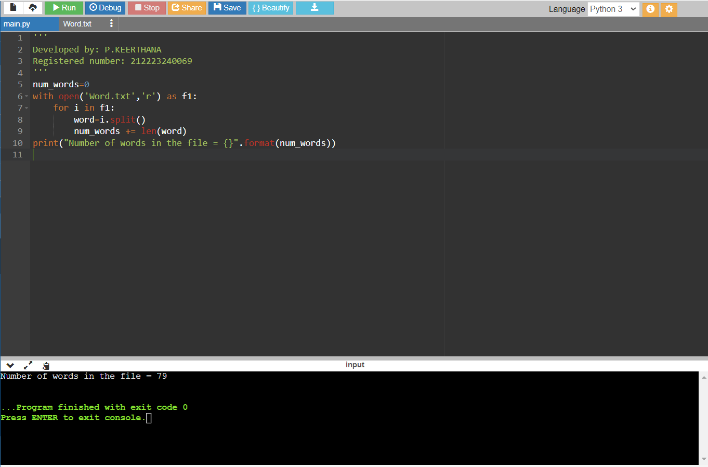
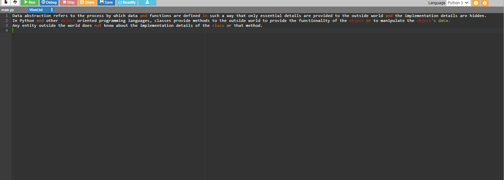

# Word-count
## AIM:
To write a python program for getting the word count from a text.
## EQUIPEMENT'S REQUIRED: 
PC
Anaconda - Python 3.7
## ALGORITHM: 
### Step 1:
Instalize the value for count as zero
### Step 2: 
Using open command open the txt file to read
### Step 3: 
Use the split() command
### Step 4:  
print the counted words
### Step 5: 
End the program

## PROGRAM:
```
Developed by: P.KEERTHANA
Registered number: 212223240069
'''
num_words=0
with open('file.txt','r') as f1:
    for i in f1:
        word=i.split()
        num_words += len(word)
print("Number of words in the file = {}".format(num_words))
```

### OUTPUT:




## RESULT:
Thus the program is written to find the word count from a text.
